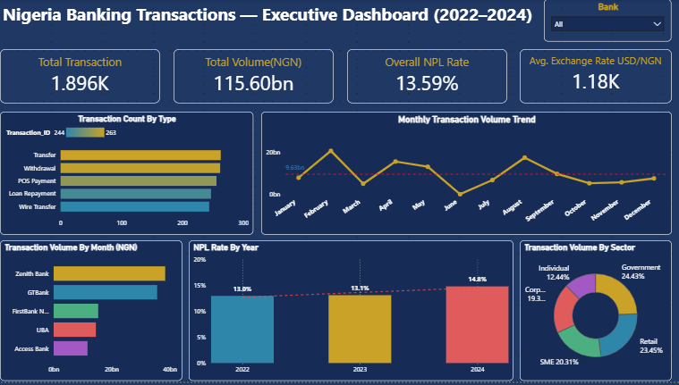

# 🏦 Nigeria Banking Transactions — Data Analysis Project



## 📌 Project Overview

This project analyses **1,942 banking transactions** across five major Nigerian banks (2022–2024), covering a combined transaction volume of **₦115.6 billion**. It demonstrates a complete, real-world data analyst workflow — from receiving messy raw data, cleaning it, analysing trends, and presenting findings on an interactive Power BI dashboard.

> **Note:** This dataset was synthetically generated to simulate realistic Nigerian banking transaction data. It does not represent real customer or bank data.

---

## 🎯 Business Questions Answered

- How did transaction volume trend month-by-month across 2022–2024?
- Which bank processes the highest transaction value — and which carries the most loan default risk?
- How is activity distributed across sectors (Retail, Corporate, SME, Government, Individual)?
- Which transaction types are most frequent and most valuable?
- How has the Naira-to-Dollar exchange rate moved, and what is its relationship with rising NPL rates?

---

## 🗂️ Project Structure

```
nigeria-banking-analysis/
│
├── data/
│   ├── raw_dirty_data.csv          # Original messy dataset (2,079 rows)
│   ├── cleaned_data.csv            # Cleaned dataset (1,942 rows)
│   └── cleaning_log.csv            # Step-by-step record of every fix applied
│
├── excel/
│   └── Nigeria_Banking_Analysis.xlsx   # Full Excel workbook (cleaning + analysis + dashboard)
│
├── powerbi/
│   └── Nigeria_Banking_Dashboard.pbix  # Interactive Power BI dashboard
│
├── images/
│   └── dashboard_preview.png       # Dashboard screenshot for README preview
│
└── README.md                       # You are here
```

---

## 🧹 Data Cleaning — What Was Fixed

The raw dataset contained **13 categories of data quality issues**. All cleaning was done in **Microsoft Excel (Power Query)**.

| # | Issue | Rows Affected | Fix Applied |
|---|---|---|---|
| 1 | Completely blank rows | 13 | Removed entirely |
| 2 | Exact duplicate transactions | 15 | Removed using Remove Duplicates |
| 3 | Inconsistent bank names (`GT Bank`, `gtbank`, `GTB`) | 543 | Standardized to 5 official names |
| 4 | Inconsistent transaction types (`Withdawal`, `WITHDRAWAL`) | 464 | Standardized to 8 official types |
| 5 | Inconsistent sector names (`Govt`, `GOVT`, `Gov't`) | 436 | Standardized to 5 official sectors |
| 6 | Mixed date formats (`DD/MM/YYYY`, `Jan 5, 2023`) | 71 | Converted to `YYYY-MM-DD` |
| 7 | Missing Customer IDs | 109 | Rows removed — untraceable transactions |
| 8 | Year/Month out of sync with Date | 37 | Recalculated from transaction date |
| 9 | Inconsistent Debit/Credit labels (`DR`, `CR`, `D`, `C`) | 6 | Standardized using transaction type |
| 10 | Negative transaction amounts | 34 | Converted to absolute values |
| 11 | Outlier amounts (≥ ₦100M) | 24 | Flagged in `Outlier_Flag` column for review |
| 12 | Missing Interest Rate / Exchange Rate / Balance | 293 | Filled with column median |
| 13 | Inconsistent NPL flags (`Y`, `1`, `True`, blank) | 176 | Standardized to `Yes` / `No` |

**Result:** 2,079 rows → **1,942 clean rows** ready for analysis.

---

## 📊 Key Findings

### 1. Transaction Volume Trend
Monthly transaction volume fluctuated significantly across 2022–2024, with peaks in **September 2022** and **April 2024**. Low-volume months in early and mid-2024 may indicate seasonal corporate/government spending patterns or reporting gaps worth investigating.

### 2. Bank Performance
| Bank | Total Volume | NPL Rate |
|---|---|---|
| Zenith Bank | ₦38.4B | 13.0% |
| GTBank | ₦35.6B | 12.1% ✅ Lowest |
| FirstBank Nigeria | ₦15.3B | 13.9% |
| UBA | ₦14.5B | 14.5% |
| Access Bank | ₦11.7B | 14.5% ⚠️ Highest |

Zenith Bank and GTBank account for over **64% of total transaction value** despite handling roughly the same number of transactions as the other three banks — indicating a concentration of high-value corporate and government clients.

### 3. Sector Distribution
Government and Retail together account for nearly **47.8% of all transaction value**, while the Individual segment contributes the smallest share at **12.4%** — consistent with individuals typically moving smaller amounts than institutional clients.

### 4. Rising NPL Risk ⚠️
| Year | NPL Rate |
|---|---|
| 2022 | 12.96% |
| 2023 | 13.09% |
| 2024 | **14.79%** |

NPL rates climbed steadily over the three years, with the sharpest jump in 2024 — coinciding with a weakening Naira exchange rate. This pattern is consistent with currency depreciation increasing the cost of debt servicing for borrowers.

---

## 🛠️ Tools & Skills Used

| Tool | How It Was Used |
|---|---|
| **Microsoft Excel (Power Query)** | Data import, cleaning, transformation, audit log |
| **Microsoft Excel (PivotTables)** | Summary analysis tables — volume, NPL, sector, bank breakdowns |
| **Power BI Desktop** | Interactive dashboard with slicers, KPI cards, and 5 chart visuals |

### Excel Functions Used
`SUMIFS` · `COUNTIFS` · `AVERAGEIFS` · `YEAR` · `TEXT` · `ROUNDUP` · `MONTH` · `IF` · `ISNULL`

### Power BI Features Used
- Power Query data validation
- DAX measure: `NPL Rate = DIVIDE(COUNTROWS(FILTER(...)), COUNTROWS(...))`
- Interactive slicers (Year, Bank, Sector)
- Cross-filtering across all visuals
- KPI cards, Line chart, Bar chart, Donut chart, Column chart

---

## 💡 Recommendations

1. **Prioritise a credit review at Access Bank and UBA** — both carry the highest NPL rate at 14.5%
2. **Investigate low-volume months in 2024** (January, June, October) to confirm whether they reflect genuine slowdowns or data gaps
3. **Monitor the NPL-to-exchange-rate relationship** going into 2025 — if the trend continues, Naira depreciation could push NPL rates above 15%
4. **Review the 24 flagged outlier transactions** (≥ ₦100M) before including them in any official financial reporting

---

## 👤 Author

**Joseph Ejoh**
Data Analyst | Abuja, Nigeria
- 🌐 Portfolio: [josephejoh.github.io](https://josephejoh.github.io)
- 💼 GitHub: [github.com/JosephEjoh](https://github.com/JosephEjoh)
- 📧 Open to remote data analyst opportunities

---

*This project is part of my data analytics portfolio. Feel free to explore the files, and reach out if you have any questions.*

